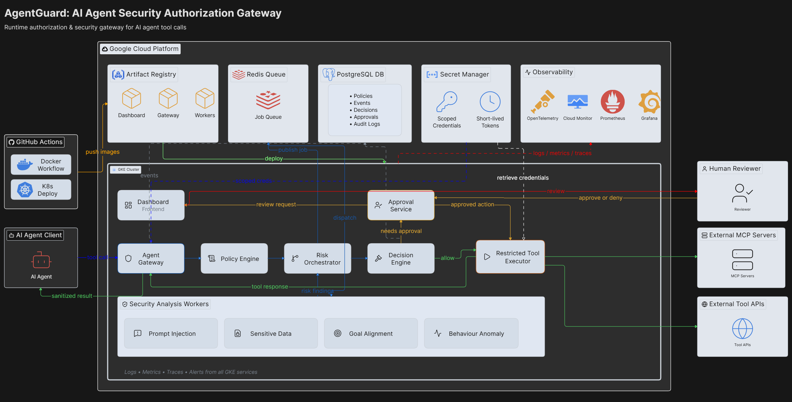

# AgentGuard

 

  

  <h3 align="center">AgentGuard</h3>

  

    An open-source runtime authorization and security gateway for AI agent tool calls.
     
     
    <a href="https://github.com/DSC-McMaster-U/agent-gaurd">View Demo</a>
    ·
    <a href="https://github.com/DSC-McMaster-U/agent-gaurd/issues/new?labels=bug">Report Bug</a>
    ·
    <a href="https://github.com/DSC-McMaster-U/agent-gaurd/issues/new?labels=enhancement">Request Feature</a>
  

<!-- ABOUT THE PROJECT -->
## About The Project

AgentGuard is an open-source security gateway for AI agents that interact with external tools such as email services, databases, file systems, APIs, code execution environments, and Model Context Protocol servers.

AgentGuard is designed to intercept every proposed tool call before execution. It will evaluate actions using authorization policies, argument validation, prompt-injection detection, sensitive-data analysis, and optional human approval.

Based on the evaluation, AgentGuard may allow, block, restrict, rewrite, sandbox, rate-limit, or pause an action for approval.

The project will also include an open security benchmark for measuring attack success rates, benign task completion, false-positive rates, and false-negative rates.

### Built With

* [![React][React.js]][React-url]
* [![FastAPI][FastAPI]][FastAPI-url]
* [![Python][Python]][Python-url]
* [![Redis][Redis]][Redis-url]
* [![PostgreSQL][PostgreSQL]][PostgreSQL-url]
* [![Docker][Docker]][Docker-url]
* [![GKE][GKE]][GKE-url]
* [![GoogleCloud][GoogleCloud]][GoogleCloud-url]
* [![GitHubActions][GitHubActions]][GitHubActions-url]
* [![OpenTelemetry][OpenTelemetry]][OpenTelemetry-url]
* [![Prometheus][Prometheus]][Prometheus-url]
* [![Grafana][Grafana]][Grafana-url]

### AgentGuard Architecture

The proposed architecture includes:

* An Agent Gateway for intercepting and validating tool calls
* A Policy Engine for deterministic authorization
* A Risk Orchestrator for coordinating security analysis
* Security workers for prompt injection, sensitive data, goal alignment, and behaviour analysis
* A Decision Engine for allowing, blocking, restricting, rewriting, sandboxing, rate-limiting, or pausing actions
* A Human Approval Service for high-risk actions
* A Restricted Tool Executor for securely calling external MCP servers and APIs
* Redis for asynchronous security-analysis jobs
* PostgreSQL for policies, events, decisions, approvals, and audit logs
* Google Secret Manager for scoped credentials and short-lived access tokens
* OpenTelemetry, Prometheus, Grafana, and Google Cloud Monitoring for logs, metrics, traces, and security alerts
* A GitHub Actions pipeline that builds container images, pushes them to Artifact Registry, and deploys AgentGuard to GKE

## Contributors

| Contributor | Most Used Frameworks/Tools | Notable Contributions |
| --- | --- | --- |
| **TBD**   <i>Project Lead</i> | TBD | TBD |
| **TBD**   <i>Gateway and Integrations</i> | TBD | TBD |
| **TBD**   <i>Gateway and Integrations</i> | TBD | TBD |
| **TBD**   <i>Policy and Identity</i> | TBD | TBD |
| **TBD**   <i>Policy and Identity</i> | TBD | TBD |
| **TBD**   <i>AI Security Detection</i> | TBD | TBD |
| **TBD**   <i>AI Security Detection</i> | TBD | TBD |
| **TBD**   <i>AI Security Detection</i> | TBD | TBD |
| **TBD**   <i>Dashboard and Observability</i> | TBD | TBD |
| **TBD**   <i>Dashboard and Observability</i> | TBD | TBD |

<!-- MARKDOWN LINKS -->
[React.js]: https://img.shields.io/badge/React-20232A?style=for-the-badge&logo=react&logoColor=61DAFB
[React-url]: https://react.dev/

[FastAPI]: https://img.shields.io/badge/FastAPI-009688?style=for-the-badge&logo=fastapi&logoColor=white
[FastAPI-url]: https://fastapi.tiangolo.com/

[Python]: https://img.shields.io/badge/Python-3776AB?style=for-the-badge&logo=python&logoColor=white
[Python-url]: https://www.python.org/

[Redis]: https://img.shields.io/badge/Redis-DC382D?style=for-the-badge&logo=redis&logoColor=white
[Redis-url]: https://redis.io/

[PostgreSQL]: https://img.shields.io/badge/PostgreSQL-336791?style=for-the-badge&logo=postgresql&logoColor=white
[PostgreSQL-url]: https://www.postgresql.org/

[Docker]: https://img.shields.io/badge/Docker-2496ED?style=for-the-badge&logo=docker&logoColor=white
[Docker-url]: https://www.docker.com/

[GKE]: https://img.shields.io/badge/GKE-4285F4?style=for-the-badge&logo=googlecloud&logoColor=white
[GKE-url]: https://cloud.google.com/kubernetes-engine

[GoogleCloud]: https://img.shields.io/badge/Google_Cloud-4285F4?style=for-the-badge&logo=googlecloud&logoColor=white
[GoogleCloud-url]: https://cloud.google.com/

[GitHubActions]: https://img.shields.io/badge/GitHub_Actions-2088FF?style=for-the-badge&logo=githubactions&logoColor=white
[GitHubActions-url]: https://github.com/features/actions

[OpenTelemetry]: https://img.shields.io/badge/OpenTelemetry-000000?style=for-the-badge&logo=opentelemetry&logoColor=white
[OpenTelemetry-url]: https://opentelemetry.io/

[Prometheus]: https://img.shields.io/badge/Prometheus-E6522C?style=for-the-badge&logo=prometheus&logoColor=white
[Prometheus-url]: https://prometheus.io/

[Grafana]: https://img.shields.io/badge/Grafana-F46800?style=for-the-badge&logo=grafana&logoColor=white
[Grafana-url]: https://grafana.com/
